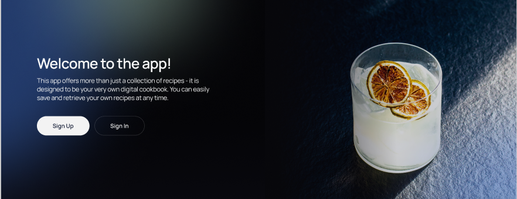

#  DrinkMaster

## 

---

## Огляд проекту

Це [веб-додаток](https://drink-master-project.vercel.app/signin), який був
створений командою "КіберСвіт" для тих, хто цінує атмосферу коктейльної культури
та різноманіття напоїв. Наш додаток дозволяє зручно користуватися широкою
бібліотекою напоїв. Тут ви можете легко знаходити, переглядати та обирати напої
із нашого розмаїття, а також зберігати свої улюблені та навіть створювати
власні.

---

### Зміст

1. [Огляд проекту](#огляд-проекту)
2. [Бекенд](#бекенд)
3. [Функціонал](#функціонал)
4. [Як почати](#як-почати)
5. [Технології](#технології)
6. [Команда](#команда)

---

## Бекенд

[GitHub](https://github.com/BerkovskiiAlex/Drink-master-project-backend)
[Swagger / API Docs](https://drink-master-service.onrender.com/api-docs/)

---

## Функціонал

Наш додаток пропонує ряд зручних можливостей, які дозволяють вам насолоджуватися
особистим досвідом та внести свій внесок до спільноти.

- **Автентифікація користувача:** Створіть власний обліковий запис та керуйте
  ним, персоналізуючи свій досвід використання додатка.

- **Додавання своїх напоїв:** Поділіться своїми унікальними рецептами напоїв із
  спільнотою, додавши їх до нашої бібліотеки.

- **Пошук напоїв:** Здійснюйте пошук напоїв за різними критеріями, такими як
  назва, інгредієнти чи тип.

- **Перегляд рецептів:** Після виконаного пошуку переглядайте інформацію про
  напій, включаючи список інгредієнтів, інструкції з приготування та зображення.

- **Додавання обраних:** Зареєстровані користувачі можуть додавати напої до
  свого списку обраних, щоб зручно зберігати та знаходити свої улюблені напої.

- **Додавання власних рецептів:** Додавайте власні рецепти коктейлів та напоїв,
  вказуючи назву, перелік інгредієнтів та інструкції з виготовлення. Ваш внесок
  допомагає розширювати нашу бібліотеку та дозволяє вам поділитися своїми
  улюбленими створеннями з іншими користувачами.

---

## Як почати

1. Клонуйте репозиторій:
   `git clone https://github.com/IrynaDidkivska/DrinkMaster`
2. Встановіть залежності: `npm install`
3. Запустіть додаток: `npm start`

## Технології

Цей проект був створений за допомогою [Vite](https://vitejs.dev/) +
[React](https://reactjs.org/). Проект використовує такі технології та
інструменти:

##### Фронтенд

- [React](https://reactjs.org/) - JavaScript бібліотека для розробки інтерфейсів
  користувача.
- [Redux](https://redux.js.org/) - Контейнер стану для JavaScript додатків.
- [HTML5](https://developer.mozilla.org/en-US/docs/Web/Guide/HTML/HTML5) -
  Остання версія мови розмітки для створення веб-сторінок.
- [CSS3](https://developer.mozilla.org/en-US/docs/Archive/CSS3) - Остання версія
  таблиці стилів для оформлення веб-сторінок.
- [Styled Components](https://styled-components.com/) - Бібліотека для написання
  CSS в стилі JavaScript для компонентів React.
- [JavaScript](https://developer.mozilla.org/en-US/docs/Web/JavaScript) - Мова
  програмування для реалізації динамічної поведінки веб-сторінок.
- [GitHub](https://github.com/) - Веб-платформа для зберігання та спільної

##### Бекенд

- [NodeJS](https://nodejs.org/) - JavaScript середовище виконання на стороні
  сервера.
- [MongoDB](https://www.mongodb.com/) - NoSQL база даних.
- [Swagger](https://swagger.io/) - Інструмент для документування API.
- [GitHub](https://github.com/) - Веб-платформа для зберігання та спільної
  роботи з кодом.

##### Дизайн та управління проектом

- [Figma](https://www.figma.com/) - Інструмент для дизайну та прототипування
  веб-сторінок.
- [Trello](https://trello.com/) - Інструмент для управління проектами та
  завданнями.

##### Комунікація та Онлайн-Зустрічі

- [Discord](https://discord.com/) - Платформа для текстової та голосової
  комунікації в реальному часі.
- [Slack](https://slack.com/) - Платформа для комунікації та спільної роботи
  команди.
- [Zoom](https://zoom.us/) - Платформа для відеоконференцій та онлайн-зустрічей.

## Команда

Проект розроблений командою "КіберСвіт":

- **Ірина Дідківська:** Тімлід/Розробник.
  - [GitHub](https://github.com/IrynaDidkivska)
  - [LinkedIn](https://www.linkedin.com/in/iryna-didkivska/)
- **Олексій Берківський:** Тімлід-Бекенд/Розробник
  - [GitHub](https://github.com/BerkovskiiAlex)
- **Ігор Золотоверх:** Скрам-мастер/Розробник
  - [GitHub](https://github.com/IhorZolot)
  - [LinkedIn](www.linkedin.com/in/ihor-zolotoverkh)
- **Олег Андрійчук:** Розробник/опора команди
  - [GitHub](https://github.com/OAndrijchuk)
  - [LinkedIn](https://www.linkedin.com/in/oleh-andrijchuk/)
- **Ольга Лазаренко:** Розробник
  - [GitHub](https://github.com/Olga-Olga)
  - [LinkedIn](https://www.linkedin.com/in/olga-lazarenko-1161482a/)
- **Тарас Ковалик:** Розробник
  - [GitHub](https://github.com/tarik2454)
  - [LinkedIn](https://www.linkedin.com/in/taras-kovalyk/)
- **Слєпченко Юлія:** Розробник
  - [GitHub]
  - [LinkedIn]
- **Ілля Чечельницький:** Розробник
  - [GitHub]
  - [LinkedIn]

---

## [ DrinkMaster](https://drink-master-project.vercel.app/signin)
